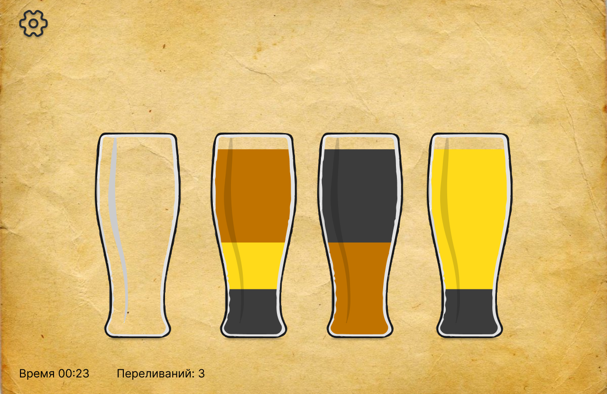

# Проект игры Water Sort Puzzle

## О проекте

"Water Sort Puzzle" - это увлекательная и сложная игра, которая проверяет ваши навыки сопоставления цветов и решения головоломок. Игра представляет игрокам сетку бутылок, заполненных жидкостями разного цвета, которые необходимо рассортировать.

Ключевая механика игры заключается в сортировке жидкостей в бутылках путем переливания их из одной бутылки в другую, достижения цели - разделить их по цвету. Игроки могут переливать жидкости из одной бутылки в другую, только если в принимающей бутылке достаточно места и переливаемые жидкости имеют одинаковый цвет. Задача состоит в том, чтобы найти правильную последовательность ходов для успешного разделения всех жидкостей по цветам.

### Схема стартового экрана

По мере прохождения уровней головоломки усложняются, увеличивается количество бутылок и комбинаций цветов. Игрокам необходимо разрабатывать стратегию и тщательно планировать свои действия, чтобы не застрять и не смешать не те цвета. Игра также может включать задачи на время или ограниченные ходы, чтобы добавить дополнительный уровень сложности.

Головоломка "Сортировка воды" обеспечивает увлекательный игровой процесс с красочной графикой, реалистичной физикой жидкости и интуитивно понятным управлением. Игроки могут соревноваться с друзьями, отслеживать свой прогресс и открывать новые уровни по мере решения каждой головоломки.

## Игровые механики:

Управление будет с помощью мыши.

В игре будет возможность кастомизации бокалов и фона. 

